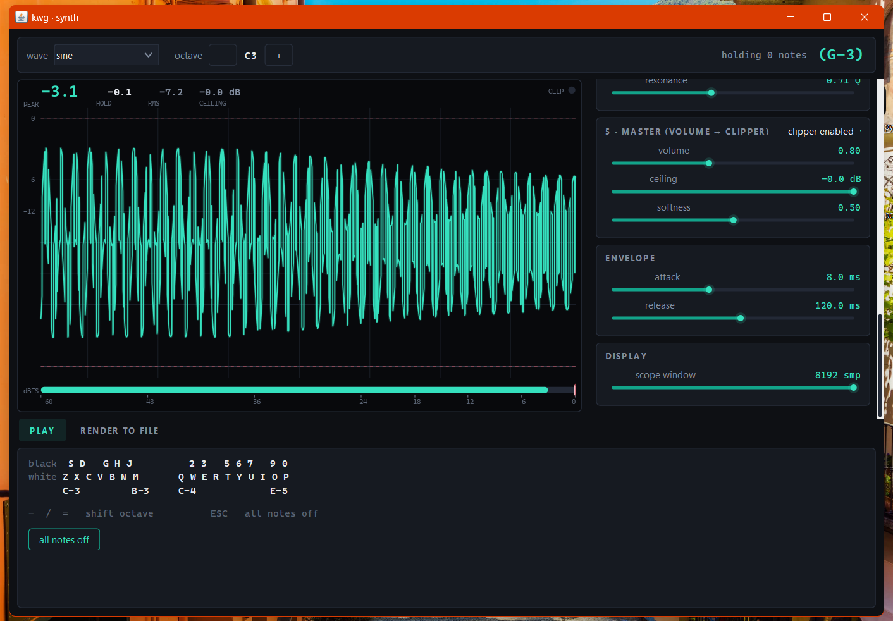

I want to build a files generator from scratch using Kotlin. Learning through the vibe.

~No AI agents coding my stuff~, just Q&A and critical thinking learning and taking notes, _but letting some vibecoded functions be in_, it's a personal hobby in the end.

## screenshots

    

## 8-20-2026

refactoring the directories. thinking on migrating UI from java swing (which the agents did by default) to _Compose Multiplatform_.

## 8-19-2026

as this is a personal stuff and a hobbies, now that I have the basics of Kotlin, I will develop the app using some vibecoded parts. This is a vibe, but I will check results too, avoiding misleading results and not breaking apart any stuff. Main target now is not the *engine* itself, more like I want to build sounds.

later on I will add a UI.

## 8-18-2026

last 4 days I've been coding without much internet.

did some refactor and built the skeleton and core of what it could be a good app for generating cool defined (or random) samples for my experimental music.

the idea right now is implement various modules or effects (serum inspired idea) and blend them together.

as this tool is a byte render from zero tool, I could use this better crazy stuff. will see.

## 8-14-2026

kotlin so far looks really charming when it matters to low lever coding. despite java morbose sintaxis, this stuffs lets you be the same time verbose and clear, with quite cool modern syntax sauce and structures.

just learned the differences between java and kotlin when it comes to _enums_ kind of structure, and it's really cool: we use something called `companion object`'s, and they work like such but in a really different way and with better performance that enums are defined in Java.

the ecosystem of kotlin is really cool compared with Java for sure. cant say much more, it's excellent in a way that there are endless chances for good patterns.

implemented the header with some sauce of enums and companion objects and data classes.

## references

https://en.wikipedia.org/wiki/WAV
